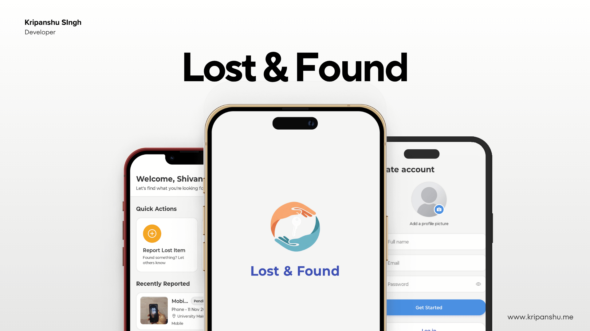
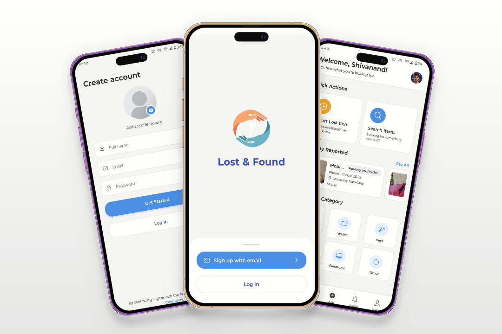
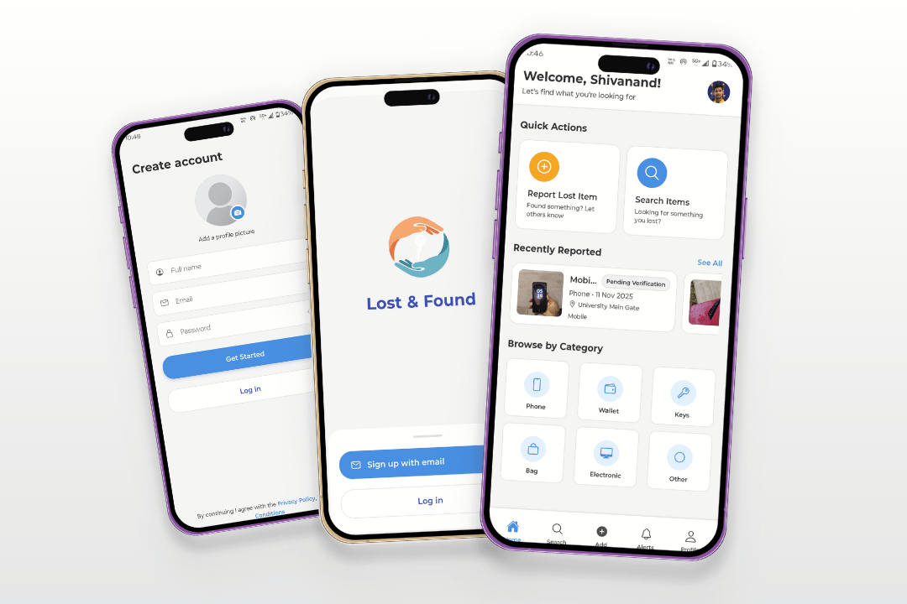
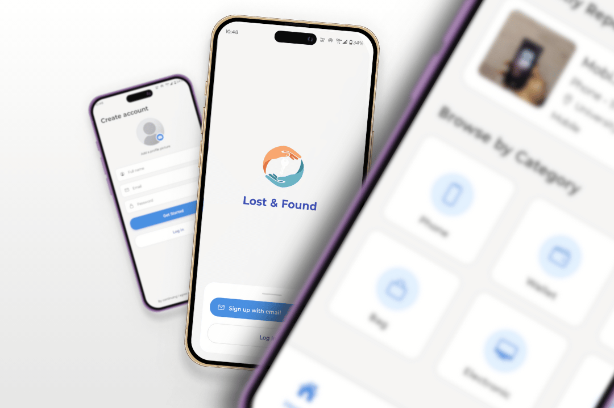

# **Lost & Found** — A React Native mobile app for reporting, tracking, and claiming lost items within a campus environment.

[](https://expo.dev/)
[](https://github.com/kripanshu-singh/lost-and-found-app/releases/download/v1.0.0/LostAndFoundApp-v1.0.0.apk)
[](LICENSE)

<p align="center">
  
</p>

<p align="center">
  
  
  
</p>

**Why this exists:**  
In active community environments like university or corporate campuses, lost items are common but locating them is often highly fragmented. Physical lost-and-found counters, unstructured chat groups, and bulletin boards are slow and inefficient. This application acts as a centralized, real-time lost-and-found registry, enabling swift reporting, location-aware matching, and secure verification to return items to their owners as quickly as possible.

## Features

*   🔑 **Secure Authentication**: Built-in signup and login using JWT access/refresh token rotation stored securely in Expo SecureStore.
*   📸 **Rich Item Reporting**: Report found items with up to 5 photos, detailed descriptions, category tagging, and date logs.
*   🗺️ **Interactive Maps & Location**: Pinpoint exact locations on a map with autocomplete suggestion drop-downs.
*   🔍 **Advanced Search & Filtering**: Locate items quickly with keyword search and complex filters for category, status (Available, Claimed, Pending), and dates.
*   📥 **Claims Workflow**: Submit and manage claims with full verification status tracking (Pending, Approved, Rejected).
*   🔔 **Custom Item Alerts**: Create custom notifications for specific categories and keywords to be notified immediately when matches are reported.
*   🌓 **Adaptive Theme System**: Supports fully responsive Light, Dark, and system-level themes.

## Tech Stack

*   **Framework**: React Native with Expo SDK 54 (Expo Router v6)
*   **Programming Language**: TypeScript
*   **Styling**: NativeWind (Tailwind CSS) & StyleSheet API
*   **HTTP Client**: Axios with automatic JWT interceptors
*   **Storage**: Expo SecureStore (encrypted session state) & AsyncStorage
*   **Utilities**: React Native Maps, Expo Image Picker, Expo Location, Expo Notifications

## Quick Start & Installation

### Prerequisites
Make sure you have Node.js (v18+) and npm installed on your development machine.

### Steps

1.  **Clone the Repository**:
    ```bash
    git clone https://github.com/kripanshu-singh/lost-and-found-app.git
    cd lost-and-found-app
    ```

2.  **Install Dependencies**:
    ```bash
    npm install
    ```

3.  **Configure Firebase & Environment**:
    *   Download your Firebase `google-services.json` from the Firebase console.
    *   Place `google-services.json` in the project root directory.
    *   If you need custom configurations (e.g. customized API endpoints or Google Maps APIs), set `EXPO_PUBLIC_API_BASE_URL` or `GOOGLE_MAPS_API_KEY` in your environment variables.

4.  **Start the Development Server**:
    ```bash
    npm run start
    ```
    *   Press `a` to run on the Android Emulator.
    *   Press `i` to run on the iOS Simulator.

## Live Demo

🚀 **Download Android APK**: [Download LostAndFoundApp v1.0.0 APK](https://github.com/kripanshu-singh/lost-and-found-app/releases/download/v1.0.0/LostAndFoundApp-v1.0.0.apk)

---

### Author & Contributor

**Kripanshu Singh**
*   🌐 [Portfolio](https://kripanshu.me/)
*   💼 [LinkedIn](https://www.linkedin.com/in/kripanshu-singh/)
*   🐙 [GitHub](https://github.com/kripanshu-singh)
*   📄 [Resume](https://kripanshu.me/resume.pdf)
*   📧 [hi@kripanshu.me](mailto:hi@kripanshu.me)
